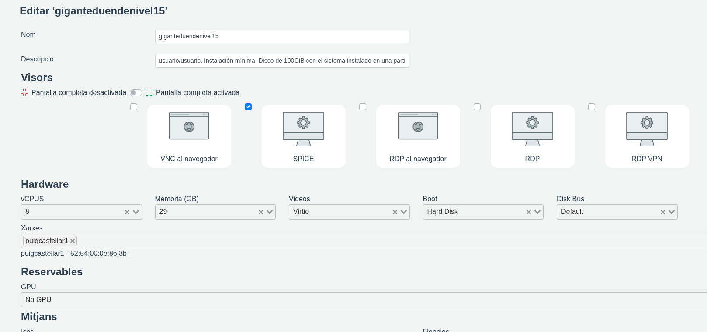
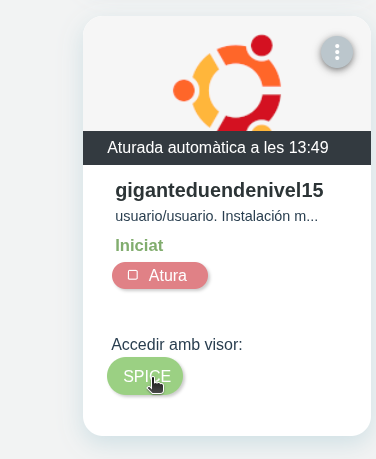

# owncloud.alr
En los siguientes enlaces enseñaré como instalar y configurar OwnCloud pero primero debemos acceder a nuestra maquina virtual de Isardvi.

[Instalar OwnCloud](https://github.com/AdriFroste/owncloud.alr/blob/main/instalar%20owncloud.md)

[Configuración de OwnCloud](https://github.com/AdriFroste/owncloud.alr/blob/main/config%20owncloud.md)
