# Configuración de OwnCloud

Ya hemos descargado OwnCloud ahora toca configurarlo y evidentemente explicarlo

## Usuarios

Ahora explicare como configurar los usuarios en OwnCloud.

En la pagina principal accedemos a nuestro propio usuario arriba a la derecha y seleccionar al boton del medio y accederemos al apartado de usuarios.

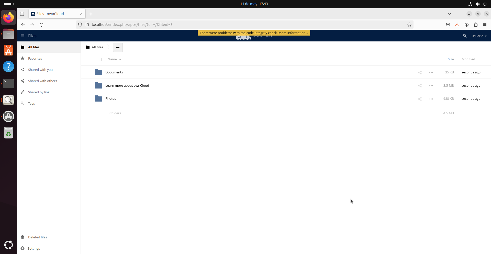
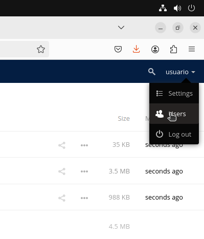
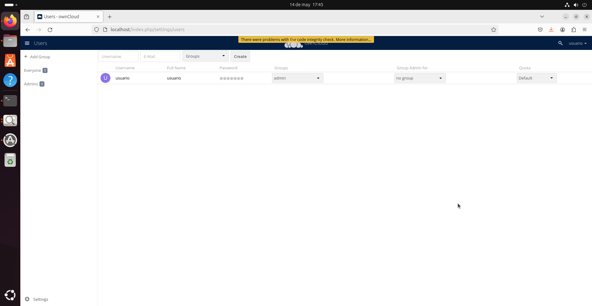

### Como crear grupos

Accederemos arriba a la izquierda y escribiremos el nombre del grupo que queramos crear
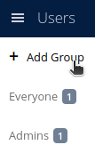
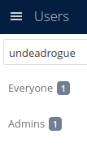
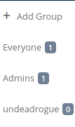

### Crear usuario

Arriba en el centro debemos añadir el username, correo, en que grupo meterlo y crear

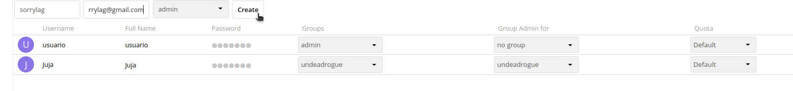

Tambien se muestra que he creado un par de usuarios y los he metido en varios grupos que tambein he creado haciendolos admins como se muestra en pantalla a la derecha de la password.
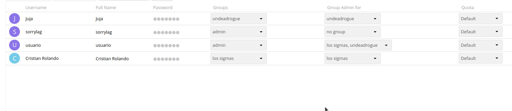

### Archivos

Hay 3 formas de subir archivos, en la pagina principal arriba a la derecha nos daran 3 opciones despues de acceder a "+", Upload, subir el archivo desde tu ordenador, folder para crear carpetas y file para crear documentos de textos.
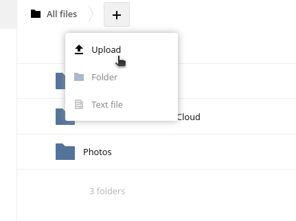

### Permisos en archivos

Accediendo a cualquier carpeta de OwnCloud podemos acceder a "sharing" y ahi `podemos dar los permisos que queramos al usuario que queramos para ese documento

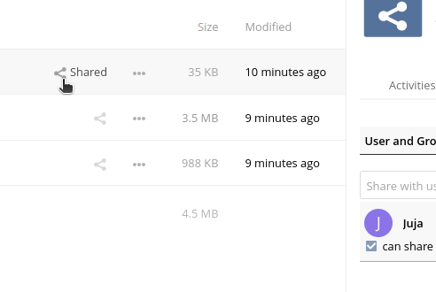
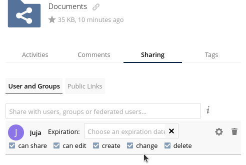
