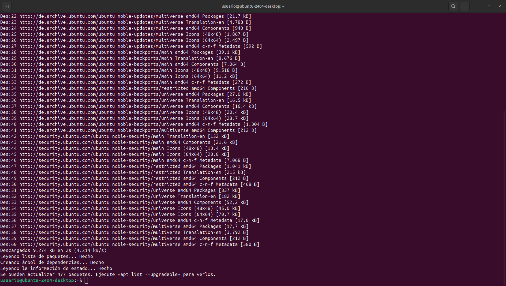
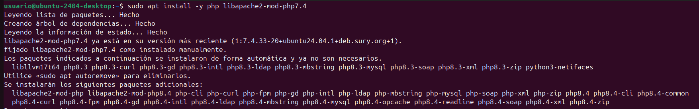

# Owncloud instalación
Aqui enseñaré como instalar el Owncloud mediante la terminal de Linux
## Instalar apache2, MySQL y librerías al contenedor
### 1. Actualización de la máquina virtual.

Para actualizar la máquina tendremos que poner el código ***sudo apt update*** en la terminal, darle al enter y esperar

Te pedira contraseña si entras por primera vez, escribe la contraseña de tu usuario, en mi caso "usuario" y le das a enter.

Después de actualizar la maquina le pondremos otro comando, el cual es: ***sudo apt upgrade*** y le daremos a enter.

Nos preguntará si queremos continuar, solo debemos escribir que si "s"

### 2. Instalar el servidor web 'apache2'.
Para instalar apache2 tendremos que poner ***sudo apt install -y apache2***

### 3. Instalación del servidor de bases de datos ***mysql-server***
Para instalar el servidor de base de datos debemos de poner ***sudo apt install -y mysql-server***

### 4. Instalación de librerías de 'php', lenguaje principal utilizado para aplicaciones.

Esto se hace con ***sudo apt install -y php libapache2-mod-php***

Ahora tenemos que poner el siguiente comando ***sudo apt install -y php-fpm php-common php-mbstring php-xmlrpc php-soap php-gd php-xml php-intl php-mysql php-cli php-ldap php-zip php-curl***

### 5. Reiniciar el servidor
***sudo systemctl restart apache2***

## Como configurar MySQL

Como acceder a la consola de MySQL
Ponemos el siguiente comando ***sudo mysql***

A continuación se deben poner comandos para crear la base de datos, un usuario, contraseña y otorgar permisos

***CREATE DATABASE bbdd;***
***CREATE USER 'usuario'@'localhost' IDENTIFIED WITH mysql_native_password BY 'password';***
***GRANT ALL ON bbdd. to 'usuario'@'localhost'***

#### Salir de la base de datos
Como se muestra en la anterior captura, salgo de la base de datos mediante el comando
***exit***

## Como instalar la versión 7.4 de PHP Ubuntu 24.04
### 1.Como instalar los requisitos previos de PPA.
Para instalar los requisitos previos de PPA debemos de poner ***sudo apt install software-properties-common -y***

### 2.Descargar herramientas necesarias para trabajar con los archivos de paquetes personales (PPA).
Debemos poner el siguiente comando ***LC_ALL=C.UTF-8 sudo add-apt-repository ppa:ondrej/php -y***

### 3.Actualizar
Utilizaremos el comando que usamos al principio, ***sudo apt update***

### 4.Instalar las librerías de PHP versión 7.4

Primero debemos de poner el siguiente comando ***sudo apt install php7.4 -y***

Ahora continuar con ***sudo apt install -y php libapache2-mod-php7.4***

Continuamos con el ultimo comando ***sudo apt install -y php7.4-fpm php7.4-common php7.4-mbstring php7.4-xmlrpc php7.4-soap php7.4-gd php7.4-xml php7.4-intl php7.4-mysql php7.4-cli php7.4-ldap php7.4-zip php7.4-curl***

### 5.Seleccionar la versión de PHP.

En este paso se debe seleccionar una versión de PHP, la 7.4

Para empezar debemos escribir ***sudo update-alternatives --config php***

A continuación pondremos al número ***2***

### 6.Activar los módulos de apache2 necesarios
Despues de haber realizado el paso anterior debemos de poner ***sudo a2enmod proxy_fcgi setenvif***

Y a continuación ***sudo a2enconf php7.4-fpm***

### 7.Reiniciar apache2

Con ***sudo service apache2 restart***

## Instalar OwnCloud

[Descargar Owncloud aqui](https://download.owncloud.com/server/stable/owncloud-complete-20240724.zip) 

## Descargar ficheros de la appweb

### 1.Cp al .zip del OwnCloud recien descargado/2. Acceder al directorio /var/www/html

Usaremos el siguiente comando ***sudo cp ~/Descargas/owncloud-complete-20240724.zip /var/www/html*** este comando varia dependiendo de la ubicación del archivo
Despues de escribir el comando anterior accederemos a /var/www/html con ***cd /var/www/html***

### 3.Descomprimir el archivo

Lo haremos con ***sudo unzip owncloud-complete-20240724.zip*** en mi caso no pude encontrar donde puse el comando por sonrecarga de texto pero lo pongo al final para saber que poner

### 4.Copiar los ficheros en la carpeta /var/www/html

Los copiaremos con ***sudo cp -R owncloud/. /var/www/html***

### 5.Eliminar la carpeta creada

Lo hacemos con ***sudo rm -rf owncloud/***

### 6.Eliminar index.html del apache2
Lo hacemos con el comando ***sudo rm -rf /var/www/html/index.html***

### 7.Permisos de  aplicaciones web

Primero vamos a la carpeta correcta con ***cd /var/www/html***
Y ahora ponemos ***sudo chmod -R 775 .***

Y finalmente pondremos ***sudo chown -R usuario:www-data .***

## Acceder a OwnCloud

Primero debemos acceder a la pagina de local host con el siguiente enlace [Local Host](http://localhost/) 

Si todo esta correcto deberia salir esto

La información que debemos poner es esta:

usuario: usuario
contraseña: password
base de datos: bbdd
dominio: localhost

Una vez puesto nos saldrá esto

Ahora toca configurar el OwnCloud, explicado en: https://github.com/AdriFroste/owncloud.alr/blob/main/config%20owncloud
